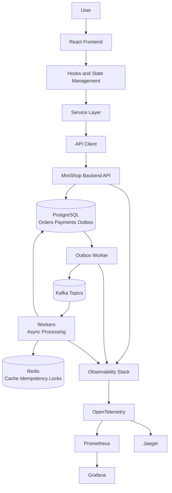
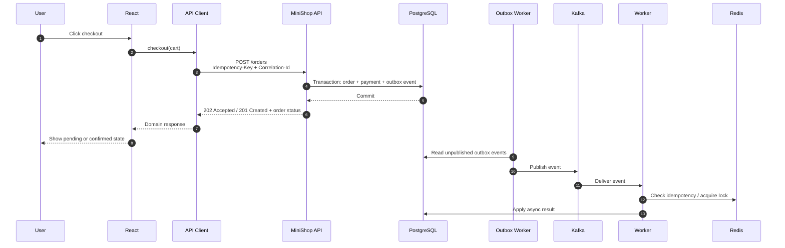
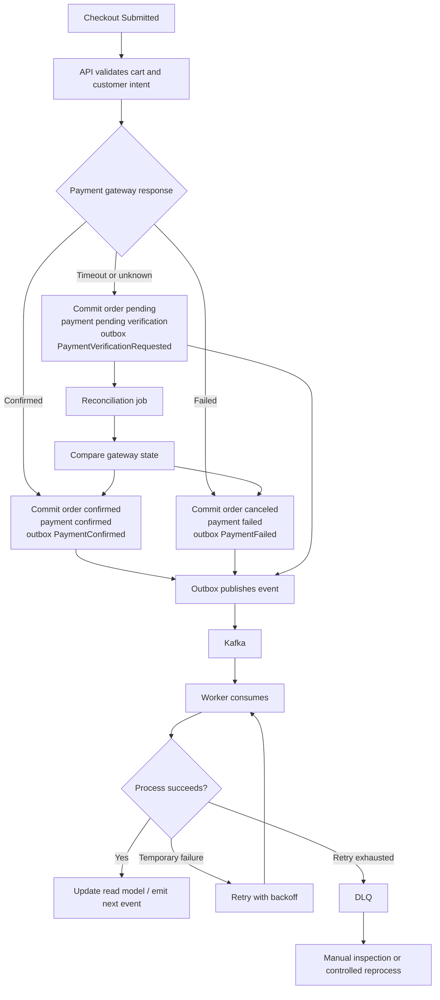
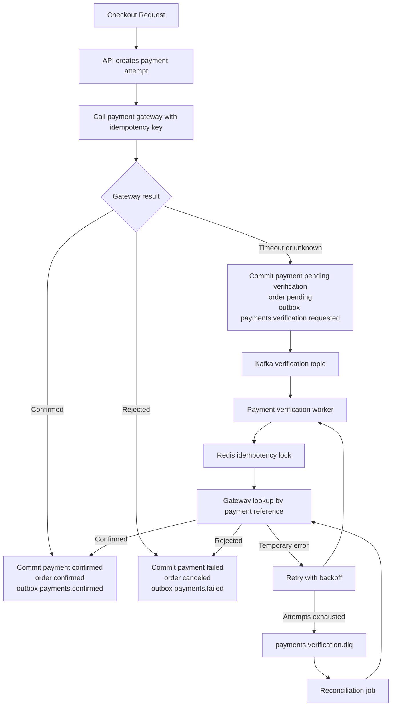
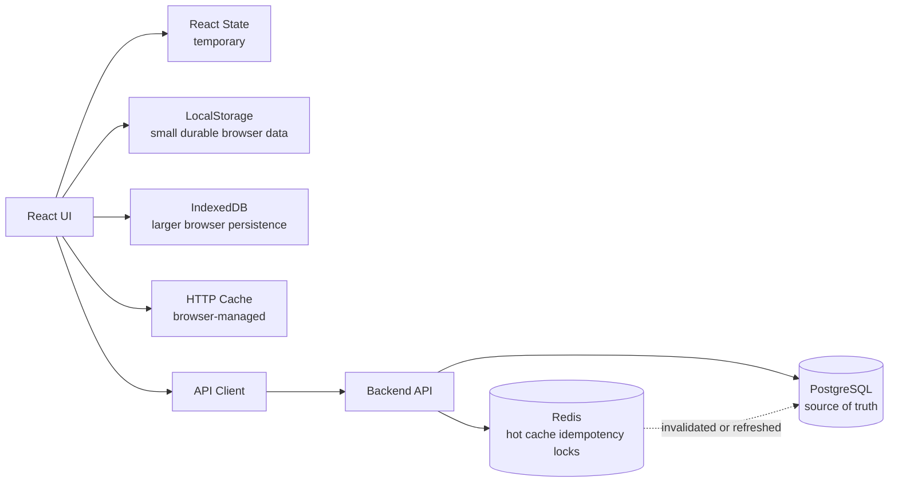
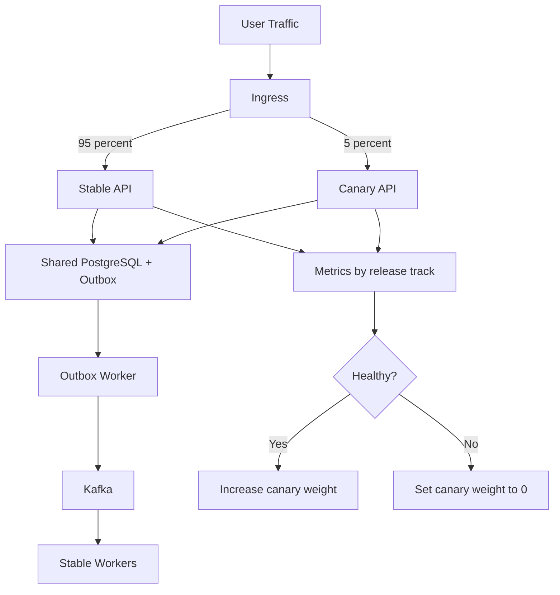

# Fullstack System Design Playbook


This repository is a documentation-first fullstack architecture playbook.

It connects React frontend engineering concepts with a production-inspired event-driven backend architecture inspired by the MiniShop project. It is not a production system and does not implement backend business logic. Its purpose is to explain how user experience, API contracts, persistence, events, asynchronous workers, caching, reliability, and observability fit together in a modern distributed system design.

Core philosophy:

- Frontend state is temporary.
- Browser storage is local persistence.
- Redis is backend acceleration.
- PostgreSQL is the source of truth.
- Kafka is system communication.
- Workers are async execution.
- The API is the contract between user experience and distributed systems.

## 1. Overview

Most frontend examples stop at components, hooks, and HTTP calls. Most backend examples start at databases, queues, and infrastructure. Real product systems live between those layers.

This playbook explains the connection point: a React application calls a backend API, the API persists business state in PostgreSQL, a transactional outbox publishes durable events to Kafka, workers process asynchronous tasks, Redis accelerates repeated work and guards idempotency, and observability makes the full path inspectable.

The style is intentionally practical: diagrams, boundary definitions, flow descriptions, and engineering tradeoffs. It borrows from common distributed systems practices used across mature engineering organizations, without claiming production scale.

## 2. Problem

Frontend tutorials often hide distributed systems complexity behind a single `fetch()` call. That makes the UI feel simpler than the system it depends on.

In real applications:

- a checkout click can create database records, payment attempts, events, retries, worker jobs, and audit logs;
- a response can be fast while downstream processing is still pending;
- duplicated requests and duplicated events are normal failure modes;
- local browser state can drift from server state;
- cache freshness, payment consistency, and retry behavior affect the user experience;
- observability is required to explain what happened after the button was clicked.

This repository treats the frontend as the beginning of a distributed workflow, not as a separate demo.

## 3. Architecture Overview



The backend is event-driven, but the frontend still experiences it through an API contract. That contract must tell the UI what is complete now, what is pending, and which identifiers can be used to track progress later.

## Projetos Interativos de Frontend e Sistema

O frontend não é apenas uma interface de usuário. Ele atua como uma camada de experiência para um sistema distribuído, traduzindo a confiabilidade, a observabilidade e a confiança operacional do backend em estados claros para o usuário.

Este playbook inclui projetos de sistema interativo e simulação com foco em confiabilidade para explorar a conexão entre React, contratos de API, eventos, observabilidade e protótipos de operações assistidas por IA.

| Ativo | Finalidade | Link |
| --- | --- | --- |
| Diagrama de Caso de Uso UML | Mapeia atores, limites e capacidades | [Ambiente de testes aberto](https://api-gateway-sandbox-690799752664.us-east1.run.app/) |
| Diagrama de Sequência UML | Simula interações distribuídas ao longo do tempo | [Abrir simulador](https://eventual-consistency-simulator-451663135116.us-west1.run.app/) |
| Vídeo de demonstração | Mostra o sistema em execução localmente | [Assistir ao vídeo](https://youtu.be/M7fd6nJGt8g) |

### Simulador de Sequência Frontend + Backend

[Abrir simulador de fluxo distribuído](https://eventual-consistency-simulator-451663135116.us-west1.run.app/)

Diagrama de Sequência UML interativo mostrando como os componentes React, hooks, camada de serviço, cliente API, API backend, PostgreSQL, Outbox, Kafka, Workers, Redis, observabilidade, IA Ops e Engenharia de Confiança interagem.

### Sandbox de Arquitetura de Casos de Uso

[Abrir sandbox de arquitetura](https://api-gateway-sandbox-690799752664.us-east1.run.app/)

Diagrama de Casos de Uso UML interativo mapeando usuários do frontend, atores do backend, limites da API, gateway seguro MCP, sistemas de observabilidade, Assistente de Operações de IA e Console de Operações de Confiança.

### Vídeo de Demonstração

[Assistir ao vídeo de demonstração](https://youtu.be/M7fd6nJGt8g)

Vídeo explicativo do playbook fullstack, console de arquitetura, inteligência de métricas, assistente de confiabilidade de IA e camada de operações de confiança do cliente.

## 4. Frontend Architecture

The frontend is organized around clear boundaries:

- **Components** render UI and collect user intent.
- **Hooks** coordinate screen-level behavior and local state.
- **State management** stores temporary UI state and shared client-side server snapshots.
- **Service layer** expresses product actions such as `checkout`, `loadOrder`, or `retryPayment`.
- **API client** owns HTTP details, headers, idempotency keys, correlation IDs, errors, and response parsing.
- **Browser persistence** stores local drafts, cached reads, preferences, and resumable flows when appropriate.

The frontend should not know how Kafka, Redis, workers, or the outbox are implemented. It should know the API contract, the domain status model, and the polling or subscription strategy for long-running workflows.

## 5. Backend Architecture

The backend is modeled after MiniShop:

- **MiniShop API** receives HTTP requests, validates input, creates domain records, and returns contract-driven responses.
- **PostgreSQL** stores orders, payments, and outbox records as the source of truth.
- **Transactional Outbox** writes domain state and event intent in the same database transaction.
- **Kafka** carries committed business events between services.
- **Workers** consume events and perform asynchronous processing.
- **Redis** supports idempotency keys, short-lived locks, and hot-read acceleration.
- **DLQ** captures messages that exceeded retry policy.
- **Saga-inspired payment consistency** coordinates checkout, verification, retry, timeout handling, and reconciliation.
- **Observability** exposes metrics, traces, and logs across API, outbox worker, Kafka, and consumers.

The API does not publish directly to Kafka. It commits state first, then the outbox worker publishes events after the database transaction succeeds.

## 6. Client-Side State vs Server-Side State

| Layer | Purpose | Durability | Source of truth |
| --- | --- | --- | --- |
| React state | Temporary rendering and interaction state | Lost on refresh | No |
| LocalStorage | Small persistent browser values | Survives refresh | No |
| IndexedDB | Larger local browser persistence | Survives refresh | No |
| Redis | Backend cache, idempotency, locks | Usually ephemeral | No |
| PostgreSQL | Durable business records | Durable | Yes |

React state is not persistence. Browser storage is local persistence, but not shared truth. Redis accelerates and protects backend operations, but it is not the business ledger. PostgreSQL is the durable system of record.

## 7. Stateless UI and Persistent Browser Storage

A stateless UI does not mean the browser stores nothing. It means the rendered interface can be rebuilt from inputs: props, server responses, URL state, and local persisted data.

Temporary UI state belongs in React state: open menus, selected tabs, validation text, optimistic flags, and in-progress form values.

Persistent browser data belongs in LocalStorage or IndexedDB when the product needs continuity: cart drafts, checkout recovery, offline reads, feature preferences, or cached catalog responses. That data must be treated as client-owned and potentially stale.

## 8. How React Connects with MiniShop

React connects through the service layer and API client:

1. A component captures user intent, such as checkout.
2. A hook calls a domain service function.
3. The service builds a request using the API client.
4. The API client sends headers such as `Idempotency-Key` and `X-Correlation-Id`.
5. MiniShop API validates the request and persists state.
6. The frontend receives an immediate response with an order ID and status.
7. The UI renders the known state and continues through polling, refresh, or later reads.

The frontend never waits for the whole distributed workflow to finish unless the API contract explicitly makes that synchronous.

## 9. Request Flow



## 10. Order Processing Flow

Checkout is a request-response interaction at the edge and an event-driven workflow behind the API.

Event-driven order flow:



Payment consistency is saga-inspired because no single transaction can cover the browser, API, database, payment gateway, Kafka, and worker execution. The design keeps each step recoverable and observable.

Payment consistency flow:



## 11. Cache Strategy



Browser cache and IndexedDB improve perceived speed and continuity. Redis improves backend latency and duplicate handling. PostgreSQL remains the authority when data correctness matters.

## 12. Reliability Patterns

- **Outbox Pattern:** prevents lost events by storing state changes and event intent in one database transaction.
- **Idempotency:** makes retries safe for HTTP requests and Kafka consumers.
- **Retry with Backoff:** gives temporary failures time to recover without overwhelming dependencies.
- **DLQ:** isolates messages that cannot be processed safely after retry exhaustion.
- **Eventual Consistency:** accepts that downstream state may lag behind the write path.
- **Canary Release:** shifts a small percentage of traffic to a new API version before broad rollout.
- **Progressive Delivery:** combines metrics, traces, feature flags, and rollback paths to reduce release risk.



## 13. Observability

Observability explains the distributed workflow after the HTTP response has returned.

- **Metrics** measure rates, latency, retries, DLQ counts, lag, and saturation.
- **Traces** connect frontend requests, API spans, database calls, outbox publishing, Kafka events, and worker processing.
- **Logs** provide structured facts with correlation IDs and domain identifiers.
- **Prometheus** stores and queries time-series metrics.
- **Grafana** turns metrics into operational dashboards.
- **Jaeger** visualizes distributed traces.
- **OpenTelemetry** standardizes instrumentation across services.

## 14. Orquestracao de Sagas com Netflix Conductor

Este playbook mostra como um mecanismo de fluxo de trabalho como o Netflix Conductor pode ser usado como um orquestrador de sagas em uma arquitetura inspirada em produção. A implementação é intencionalmente conceitual e baseada em mocks para evitar adicionar complexidade operacional desnecessária ao projeto de aprendizado.

- Este repositorio nao executa o Conductor.
- O exemplo e conceitual e educacional.
- O MiniShop demonstra atualmente confiabilidade orientada a eventos.
- O Conductor seria uma camada de orquestracao avancada para fluxos de trabalho de microsservicos mais complexos.

Veja os documentos em [docs/saga-orchestration](docs/saga-orchestration/README.md) e o prototipo visual no Console de Arquitetura do MiniShop.

## 15. Repository Map

```text
fullstack-system-design-playbook/
|-- README.md
|-- package.json
|-- index.html
|-- vite.config.ts
|-- tsconfig.json
|-- src/
|   |-- app/
|   |-- pages/
|   |-- components/
|   |   `-- architecture/
|   |-- hooks/
|   |-- mocks/
|   |-- services/
|   |   |-- architectureConsoleService.ts
|   |   |-- apiClient.ts
|   |   |-- orderService.ts
|   |   `-- productService.ts
|   |-- state/
|   |   |-- cartStore.ts
|   |   `-- orderStore.ts
|   |-- storage/
|   |   |-- localStorageAdapter.ts
|   |   `-- indexedDbAdapter.ts
|   |-- types/
|   |   |-- architecture.ts
|   |   |-- order.ts
|   |   |-- product.ts
|   |   `-- saga.ts
|   `-- utils/
|       `-- constants/
`-- docs/
    |-- architecture.md
    |-- frontend-architecture.md
    |-- backend-architecture.md
    |-- frontend-state-management.md
    |-- browser-storage-strategy.md
    |-- frontend-request-flow.md
    |-- reliability-patterns.md
    |-- observability.md
    |-- saga-orchestration/
    `-- system-design-lessons.md
```

- `README.md` is the primary playbook entry point.
- `docs/architecture.md` explains the fullstack architecture and request lifecycle.
- `docs/frontend-architecture.md` explains components, hooks, state, services, API clients, and browser persistence.
- `docs/backend-architecture.md` explains the MiniShop-inspired API, PostgreSQL, outbox, Kafka, workers, Redis, DLQ, and payments.
- `docs/frontend-state-management.md` explains React state, client stores, browser persistence, and backend truth.
- `docs/browser-storage-strategy.md` explains LocalStorage, IndexedDB, browser cache, Redis, and PostgreSQL boundaries.
- `docs/frontend-request-flow.md` explains the API flow and how to run the MiniShop backend with this frontend locally.
- `docs/reliability-patterns.md` explains reliability mechanisms and rollout patterns.
- `docs/observability.md` explains metrics, traces, logs, dashboards, and telemetry boundaries.
- `docs/saga-orchestration/` explains a conceptual Netflix Conductor saga model for MiniShop.
- `docs/system-design-lessons.md` summarizes the engineering lessons behind the architecture.

## Local Development

Run the MiniShop backend from the sibling backend project:

```bash
cd event-driven-order-processing-system-main/event-driven-order-processing-system-main
pnpm install
pnpm infra:up
```

Then keep these backend processes running in separate terminals:

```bash
pnpm -C apps/api start:dev
```

```bash
pnpm -C apps/outbox-worker start:dev
```

```bash
pnpm -C apps/worker start:dev
```

Run this frontend playbook in another terminal:

```bash
cd event-driven-order-processing-system-main/fullstack-system-design-playbook
pnpm install
pnpm dev
```

The frontend expects the MiniShop API at `http://localhost:3000`. Override it
with `VITE_MINISHOP_API_URL` when needed.

## 16. Engineering Lessons

- The API is a product contract and a distributed systems boundary.
- A fast frontend still needs honest backend status modeling.
- Local browser persistence improves continuity, but does not replace server truth.
- Reliable event publishing starts with database consistency, not Kafka calls inside controllers.
- Async workers make systems scalable, but they require idempotency and observability.
- Cache strategy is a correctness decision, not only a performance decision.
- Payment flows should be designed for unknown states, delayed verification, retry, and reconciliation.
- Progressive delivery is safer when metrics and rollback conditions are defined before release.

## 17. Author

Thiago Reis Lima

Software Engineer focused on fullstack architecture, event-driven systems, observability, and production-inspired engineering education.

## Documentation

- [Architecture](docs/architecture.md)
- [Frontend Architecture](docs/frontend-architecture.md)
- [Frontend State Management](docs/frontend-state-management.md)
- [Browser Storage Strategy](docs/browser-storage-strategy.md)
- [Frontend Request Flow](docs/frontend-request-flow.md)
- [Backend Architecture](docs/backend-architecture.md)
- [Reliability Patterns](docs/reliability-patterns.md)
- [Observability](docs/observability.md)
- [Saga Orchestration with Netflix Conductor](docs/saga-orchestration/README.md)
- [System Design Lessons](docs/system-design-lessons.md)
