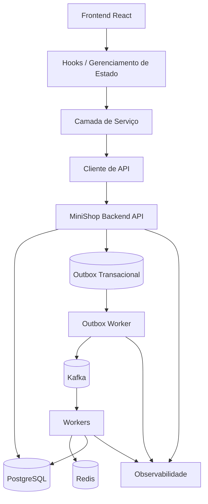
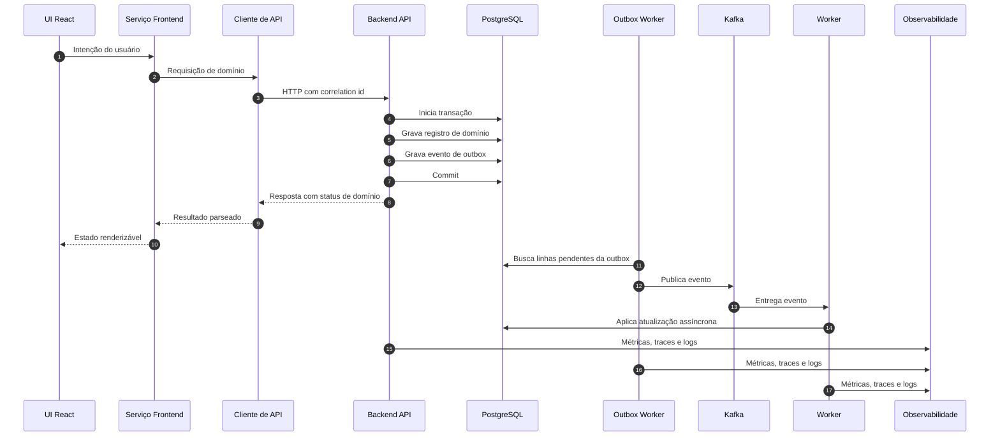
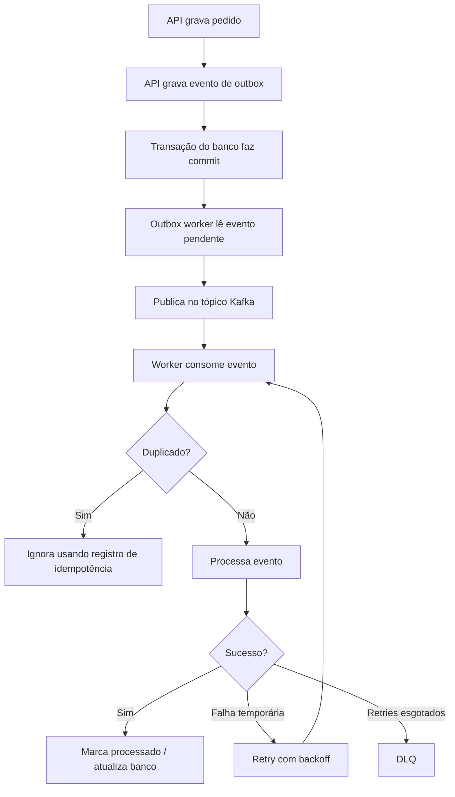

# Arquitetura

Este documento descreve a arquitetura fullstack por trás do playbook. O
repositório é uma documentação inspirada em produção, não um sistema de produção
pronto para deploy.

## Forma do sistema

A arquitetura começa em um frontend React e termina em uma execução assíncrona
observável no backend.

O frontend é dono da interação do usuário. O backend é dono do estado de negócio
durável. O Kafka conecta mudanças de estado já confirmadas ao processamento
assíncrono.

## Limites

| Limite | Responsabilidade | Não deve fazer |
| --- | --- | --- |
| Componentes React | Renderizar e capturar intenção | Conhecer detalhes internos de Kafka ou banco |
| Hooks | Coordenar estado de UI e chamadas de serviço | Codificar detalhes de transporte |
| Camada de serviço | Expressar ações de produto | Recriar HTTP de baixo nível em vários lugares |
| Cliente de API | Controlar HTTP, cabeçalhos, parsing e erros | Decidir transições de estado de domínio |
| API | Validar requisições e confirmar estado | Publicar diretamente no Kafka dentro da requisição |
| PostgreSQL | Guardar a verdade durável | Agir como fila sem disciplina de outbox |
| Outbox worker | Publicar eventos confirmados | Alterar estado de negócio inesperadamente |
| Kafka | Mover eventos entre serviços | Substituir armazenamento durável de domínio |
| Workers | Executar efeitos colaterais assíncronos | Assumir entrega exatamente uma vez |
| Redis | Cache, locks e idempotência | Virar fonte da verdade |

## Ciclo de vida da requisição

A resposta HTTP não é o fim do fluxo de trabalho. Ela é o ponto em que o frontend recebe
um identificador estável e um status atual.

## Fluxo de eventos

## Autoridade dos dados

PostgreSQL é a fonte da verdade. Kafka é o log de comunicação para eventos
confirmados. Redis é usado para aceleração e idempotência. O armazenamento do
navegador é útil para continuidade da experiência, mas não pode ser tratado como
autoridade do servidor.

## Contrato entre frontend e backend

O contrato da API deve tornar explícito o comportamento distribuído:

- identificadores estáveis de recursos;
- valores de status de domínio;
- comportamento de idempotência;
- categorias de erro;
- orientação de retry;
- correlation IDs;
- semântica de polling ou refresh;
- expectativas de consistência eventual.

A UI nunca deve inferir que o backend terminou apenas porque um loading local
desapareceu.
