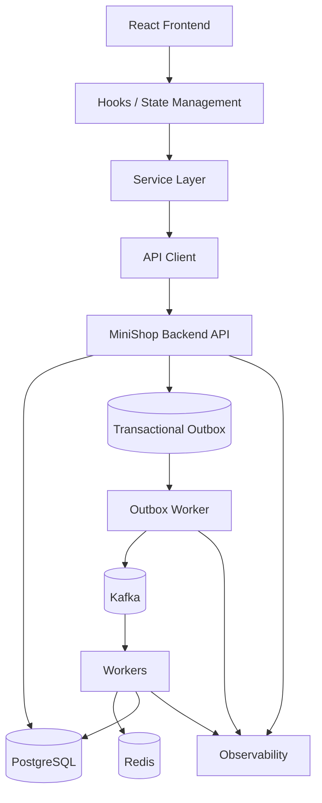
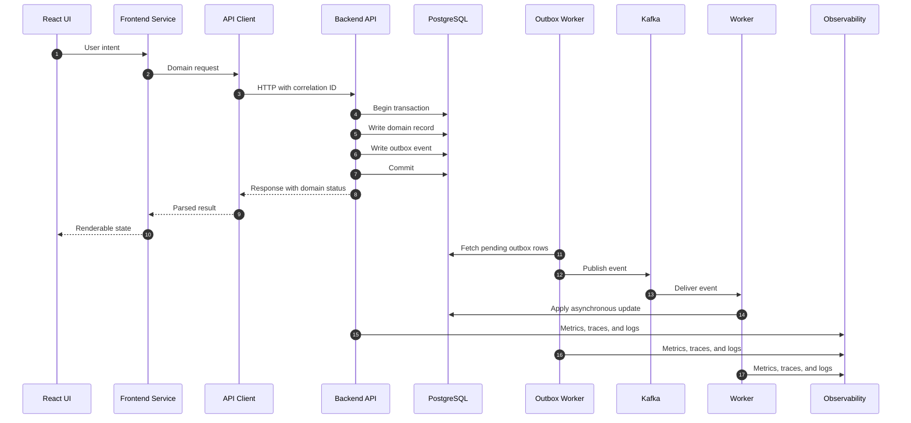
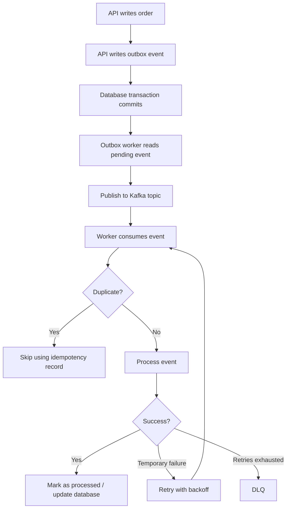

# Architecture

This document describes the fullstack architecture behind the playbook. The
repository provides documentation inspired by production systems, not a production system
ready for deployment.

## System Structure

The architecture starts with a React frontend and ends with observable asynchronous
execution in the backend.

The frontend owns user interaction. The backend owns durable business state.
Kafka connects committed state changes to asynchronous processing.

## Boundaries

| Boundary | Responsibility | Must not do |
| --- | --- | --- |
| React components | Render and capture intent | Know Kafka or database internals |
| Hooks | Coordinate UI state and service calls | Hard-code transport details |
| Service layer | Express product actions | Reimplement low-level HTTP in multiple places |
| API client | Manage HTTP, headers, parsing, and errors | Decide domain state transitions |
| API | Validate requests and commit state | Publish directly to Kafka within a request |
| PostgreSQL | Store durable truth | Act as a queue without following the outbox pattern |
| Outbox worker | Publish committed events | Change business state unexpectedly |
| Kafka | Move events between services | Replace durable domain storage |
| Workers | Execute asynchronous side effects | Assume exactly-once delivery |
| Redis | Cache, locks, and idempotency | Become the source of truth |

## Request Lifecycle

The HTTP response is not the end of the workflow. It is the point at which the frontend receives
a stable identifier and the current status.

## Event Flow

## Data Authority

PostgreSQL is the source of truth. Kafka is the communication log for committed
events. Redis provides acceleration and idempotency. Browser storage helps
maintain a continuous user experience, but it cannot be treated as authoritative
server state.

## Frontend and Backend Contract

The API contract should make distributed behavior explicit:

- stable resource identifiers;
- domain status values;
- idempotency behavior;
- error categories;
- retry guidance;
- correlation IDs;
- polling or refresh semantics;
- eventual consistency expectations.

The UI must never infer that the backend has finished simply because a local
loading indicator has disappeared.
