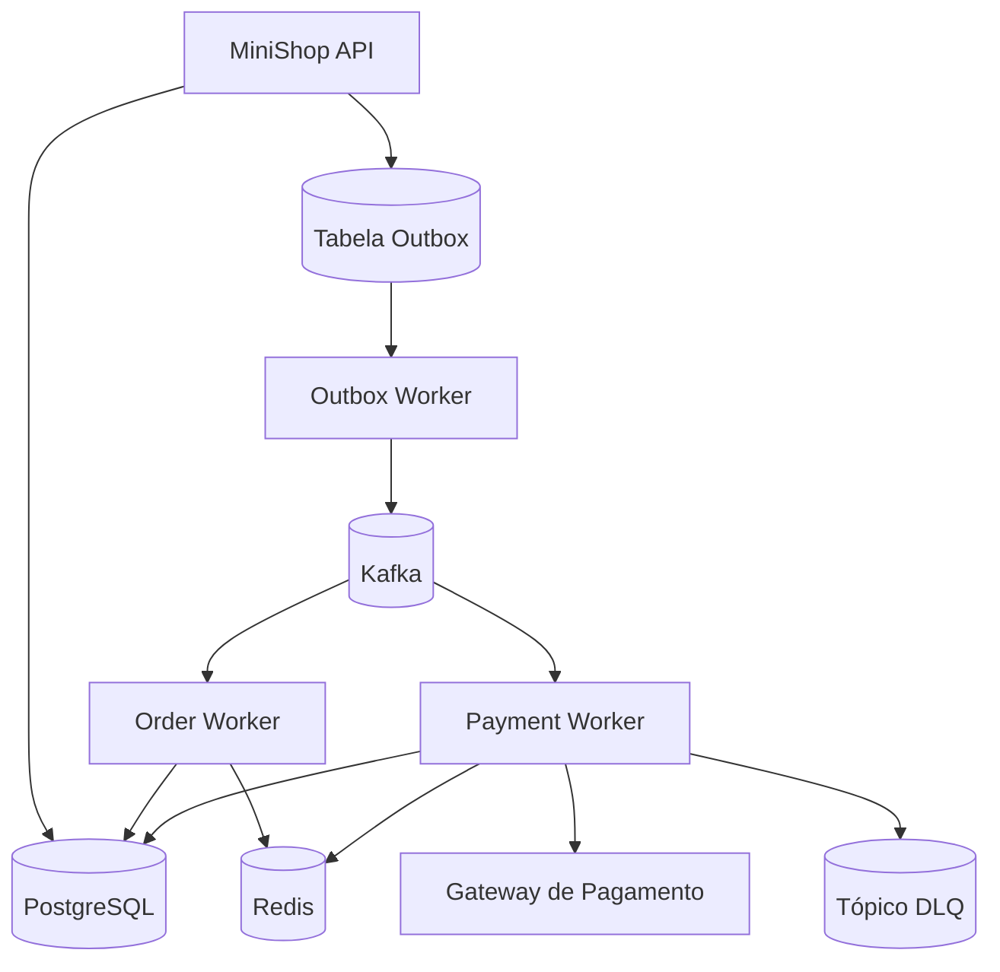
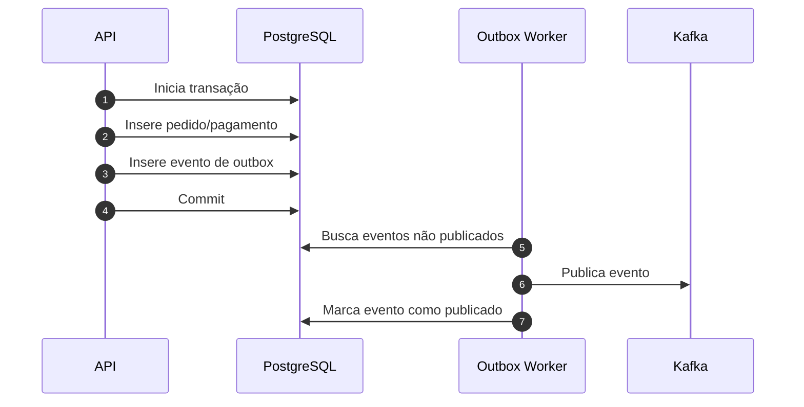
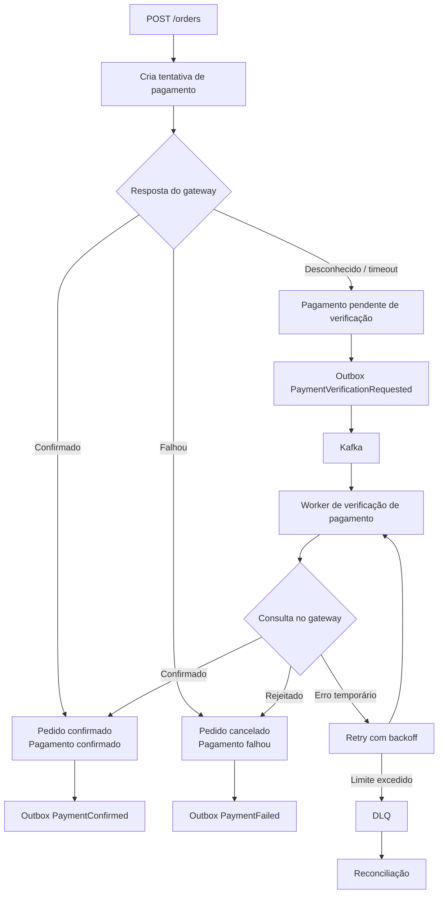

# Arquitetura do Backend

Esta arquitetura de backend é inspirada no projeto MiniShop. Ela é descrita aqui
como um desenho educacional de system design, não como um guia de implementação
pronto para produção.

## Componentes

## MiniShop API

A API é o limite síncrono entre a experiência de produto e o backend
distribuído. Ela recebe requisições, valida entradas, aplica regras de domínio,
abre transações no banco e retorna status de domínio estáveis.

A API deve:

- validar o formato da requisição e invariantes de domínio;
- gravar pedidos e pagamentos no PostgreSQL;
- gravar eventos de outbox na mesma transação;
- retornar identificadores de recurso e status atual;
- incluir correlation IDs em logs e respostas;
- evitar publicação direta no Kafka dentro de handlers HTTP.

## PostgreSQL

O PostgreSQL guarda o registro durável:

- pedidos;
- pagamentos;
- tentativas de pagamento;
- eventos de outbox;
- registros de deduplicação de webhooks;
- marcadores de reconciliação.

O banco é a fonte da verdade porque oferece consistência transacional e
auditabilidade durável.

## Outbox Transacional

A outbox transacional resolve o problema clássico de confirmar uma mudança no
banco e publicar uma mensagem de forma confiável.

Se o Kafka estiver indisponível, o registro de domínio ainda é confirmado e a
linha da outbox continua disponível para retry.

## Kafka

Kafka é a camada de comunicação para eventos de negócio já confirmados. Ele
desacopla a API da execução posterior.

Exemplos de tópicos:

- `orders.created`;
- `orders.created.dlq`;
- `payments.verification.requested`;
- `payments.confirmed`;
- `payments.failed`;
- `payments.verification.dlq`;
- `payments.reconciliation.needed`.

As chaves de partição devem preservar ordenação quando o domínio exigir, como
por `orderId` ou `paymentId`.

## Workers

Workers processam eventos assincronamente. Eles devem assumir entrega pelo menos
uma vez:

- verificar idempotência antes de efeitos colaterais;
- usar retry com backoff para falhas temporárias;
- enviar mensagens esgotadas para DLQ;
- atualizar PostgreSQL apenas por transições de domínio seguras;
- emitir métricas, logs e traces.

Workers não são um lugar para esconder comportamento de negócio invisível. As
decisões deles afetam estado visível para o usuário.

## Redis

Redis apoia a aceleração do backend:

- registros de idempotência para requisições HTTP e consumidores de eventos;
- locks de curta duração;
- cache de leitura quente;
- contadores de rate limiting quando necessário;
- dados temporários de coordenação.

Redis não deve substituir o PostgreSQL como sistema de registro.

## Consistência de Pagamento

O processamento de pagamento é modelado como um fluxo de trabalho inspirado em saga,
porque gateways de pagamento, APIs, bancos, filas e workers não podem ser
confirmados em uma única transação atômica.

A decisão importante é tornar estados desconhecidos explícitos. Timeout não é a
mesma coisa que falha.

## DLQ

A dead-letter queue é uma superfície controlada de falha. Ela armazena eventos
que não puderam ser processados com segurança depois que os retries se esgotaram.

O tratamento de DLQ deve incluir:

- payload do evento;
- motivo do erro;
- quantidade de retries;
- correlation ID;
- horário da primeira falha;
- horário da última falha;
- caminho controlado de reprocessamento.
