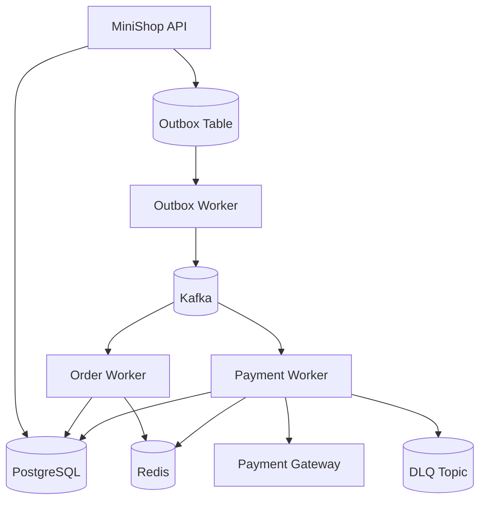
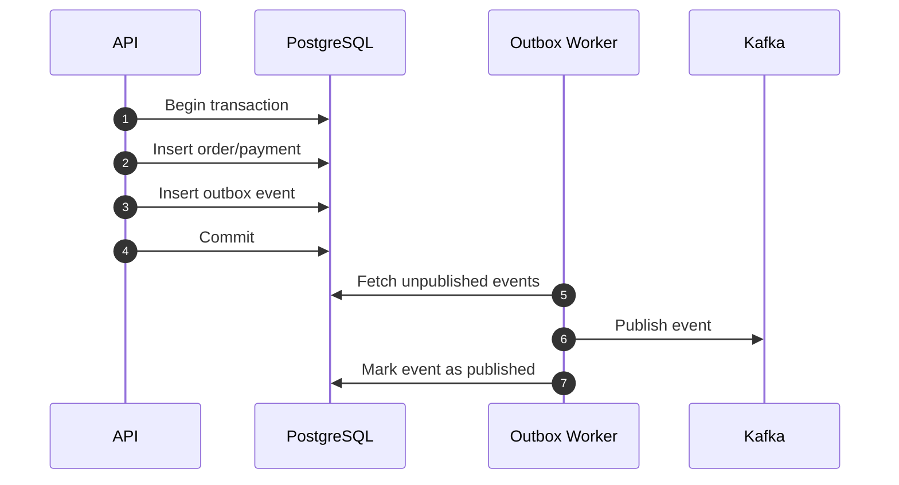
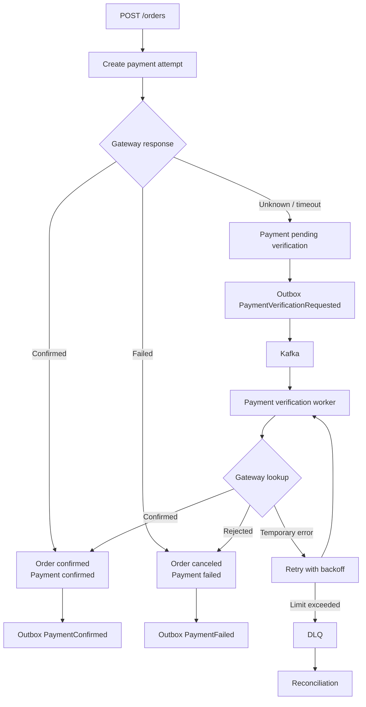

# Backend Architecture

This backend architecture is inspired by the MiniShop project. It is presented
here as an educational system design, not as a production-ready implementation
guide.

## Components

## MiniShop API

The API is the synchronous boundary between the product experience and the
distributed backend. It receives requests, validates input, applies domain rules,
opens database transactions, and returns stable domain statuses.

The API should:

- validate the request format and domain invariants;
- write orders and payments to PostgreSQL;
- write outbox events in the same transaction;
- return resource identifiers and the current status;
- include correlation IDs in logs and responses;
- avoid publishing directly to Kafka inside HTTP handlers.

## PostgreSQL

PostgreSQL stores the durable records:

- orders;
- payments;
- payment attempts;
- outbox events;
- webhook deduplication records;
- reconciliation markers.

The database is the source of truth because it provides transactional consistency
and a durable audit trail.

## Transactional Outbox

The transactional outbox solves the classic problem of committing a database
change and reliably publishing a message.

If Kafka is unavailable, the domain record is still committed and the outbox
row remains available for retry.

## Kafka

Kafka is the communication layer for committed business events. It decouples
the API from subsequent execution.

Example topics:

- `orders.created`;
- `orders.created.dlq`;
- `payments.verification.requested`;
- `payments.confirmed`;
- `payments.failed`;
- `payments.verification.dlq`;
- `payments.reconciliation.needed`.

Partition keys should preserve ordering when the domain requires it, such as
by `orderId` or `paymentId`.

## Workers

Workers process events asynchronously. They should assume at-least-once
delivery:

- check idempotency before side effects;
- retry with backoff for temporary failures;
- send messages to the DLQ when retries are exhausted;
- update PostgreSQL only through safe domain transitions;
- emit metrics, logs, and traces.

Workers should not hide business behavior. Their decisions affect state visible
to the user.

## Redis

Redis supports backend acceleration:

- idempotency records for HTTP requests and event consumers;
- short-lived locks;
- hot-read caching;
- rate-limiting counters when needed;
- temporary coordination data.

Redis should not replace PostgreSQL as the system of record.

## Payment Consistency

Payment processing is modeled as a saga-inspired workflow
because payment gateways, APIs, databases, queues, and workers cannot all commit
within a single atomic transaction.

The key decision is to make unknown states explicit. A timeout is not the same
as a failure.

## DLQ

The dead-letter queue provides a controlled way to handle failures. It stores events
that could not be processed safely after retries were exhausted.

DLQ handling should include:

- event payload;
- error reason;
- retry count;
- correlation ID;
- time of the first failure;
- time of the last failure;
- a controlled reprocessing path.
