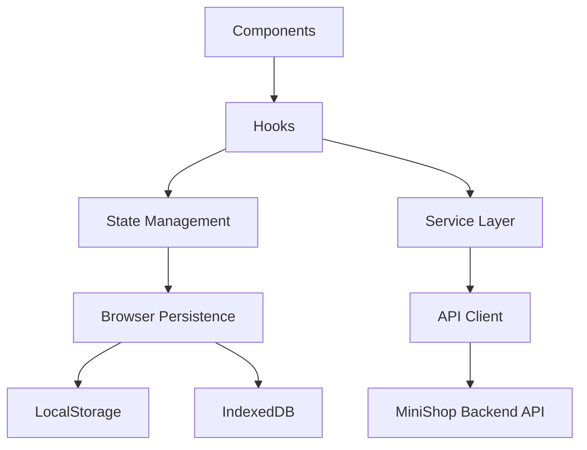

# Frontend Architecture

The frontend architecture is designed to make React a clear entry point into
a distributed backend workflow.

## Layered Model



## Components

Components render state and capture user intent. They should be small enough
to test and reason about:

- order summary;
- cart items;
- checkout form;
- payment status banner;
- retry action;
- reconciliation or pending state notice.

Components should not need to know whether the backend uses Kafka, Redis, or a
transactional outbox.

## Hooks

Hooks coordinate screen behavior:

- load an order by ID;
- submit checkout;
- maintain optimistic state;
- poll for status changes;
- persist local draft data;
- expose loading, success, failure, and pending states.

Hooks are a good place to connect React rendering with domain service
calls.

## Service Layer

The service layer expresses product operations:

```ts
checkoutOrder(input)
getOrder(orderId)
retryPayment(orderId)
getPaymentStatus(paymentId)
```

It should return domain-level results, not raw transport details.
This keeps components focused on the user experience.

## API Client

The API client owns HTTP concerns:

- base URL;
- request and response serialization;
- authentication headers when needed;
- `Idempotency-Key`;
- `X-Correlation-Id`;
- timeout handling;
- structured error mapping;
- retry policy for safe reads.

Write requests should be retried carefully and only when
idempotency is part of the contract.

## State Management

Frontend state can be divided into three categories:

| Category | Example | Storage |
| --- | --- | --- |
| Ephemeral UI state | open modal, selected tab, inline validation | React state |
| Client-side server snapshot | latest order response, payment status | query cache or state store |
| Browser-persisted state | cart draft, checkout recovery, preferences | LocalStorage or IndexedDB |

Server snapshots should be considered stale until refreshed or
invalidated by a known event.

## Browser Persistence

LocalStorage is useful for small values such as preferences, draft IDs, and
feature flags. IndexedDB is better for larger structured data such as cached
catalog responses or drafts with offline support.

Browser persistence should be designed with stale data in mind:

- data can be edited in another tab;
- data can survive logout if not cleared;
- data can be older than backend state;
- data can be modified manually by the user.

## Checkout UX Contract

Checkout should model backend uncertainty directly:

- `pending` means the request was accepted, but asynchronous work continues;
- `confirmed` means the payment and order are complete from the API's perspective;
- `failed` means the user needs a recovery path;
- `verification_required` means the payment outcome is unknown and verification continues in the backend;
- `reconciliation_needed` means the system needs an operational or scheduled correction.

The UI should show progress without pretending that all work is synchronous.
