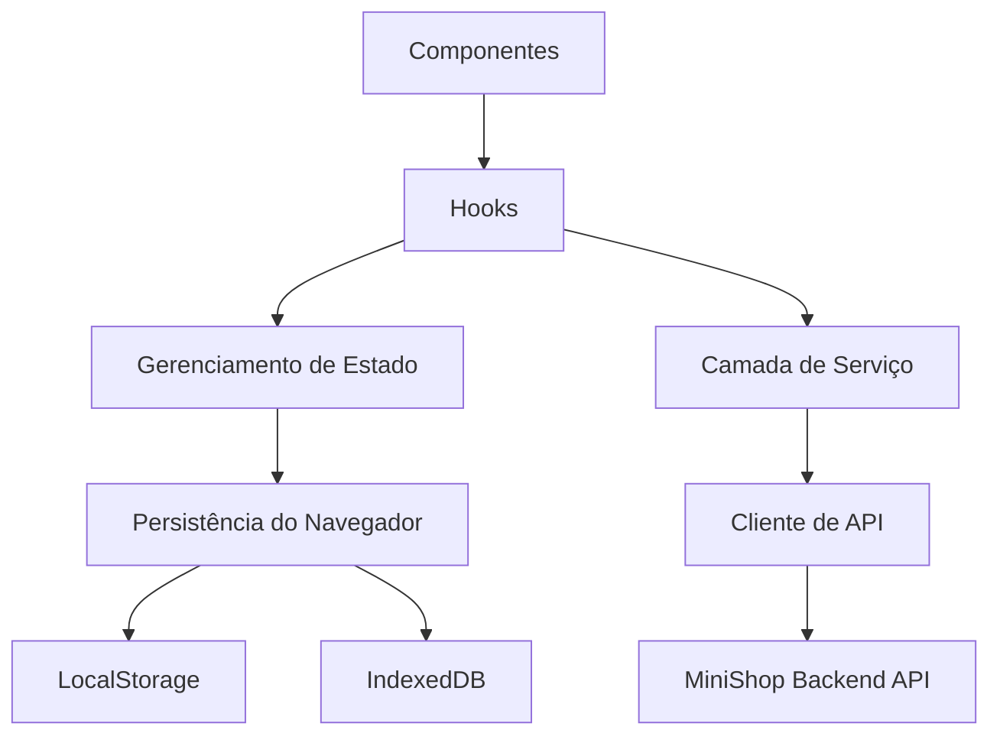

# Arquitetura do Frontend

A arquitetura do frontend foi desenhada para tornar o React uma entrada clara em
um fluxo de trabalho distribuído de backend.

## Modelo de Camadas



## Componentes

Componentes renderizam estado e capturam intenção do usuário. Eles devem ser
pequenos o bastante para testar e raciocinar:

- resumo do pedido;
- itens do carrinho;
- formulário de checkout;
- banner de status de pagamento;
- ação de retry;
- aviso de reconciliação ou estado pendente.

Componentes não devem saber se o backend usa Kafka, Redis ou uma outbox
transacional.

## Hooks

Hooks coordenam comportamento de tela:

- carregar pedido por ID;
- submeter checkout;
- manter estado otimista;
- fazer polling de mudanças de status;
- persistir dados locais de draft;
- expor estados de carregamento, sucesso, falha e pendência.

Hooks são um bom lugar para conectar a renderização React com chamadas de
serviço de domínio.

## Camada de Serviço

A camada de serviço expressa operações de produto:

```ts
checkoutOrder(input)
getOrder(orderId)
retryPayment(orderId)
getPaymentStatus(paymentId)
```

Ela deve retornar resultados no formato do domínio, não detalhes crus de
transporte. Isso mantém componentes focados na experiência do usuário.

## Cliente de API

O cliente de API é dono das preocupações HTTP:

- URL base;
- serialização de requisição e resposta;
- cabeçalhos de autenticação quando necessário;
- `Idempotency-Key`;
- `X-Correlation-Id`;
- tratamento de timeout;
- mapeamento estruturado de erros;
- política de retry para leituras seguras.

Requisições de escrita devem ser retentadas com cuidado e apenas quando
idempotência fizer parte do contrato.

## Gerenciamento de Estado

O estado do frontend pode ser dividido em três categorias:

| Categoria | Exemplo | Armazenamento |
| --- | --- | --- |
| Estado efêmero de UI | modal aberto, aba selecionada, validação inline | React state |
| Snapshot de servidor no cliente | última resposta de pedido, status de pagamento | query cache ou state store |
| Estado persistido no navegador | draft de carrinho, recuperação de checkout, preferências | LocalStorage ou IndexedDB |

Snapshots de servidor devem ser considerados antigos até serem atualizados ou
invalidados por um evento conhecido.

## Persistência do Navegador

LocalStorage é útil para valores pequenos, como preferências, IDs de draft e
feature flags. IndexedDB é melhor para dados estruturados maiores, como respostas
de catálogo em cache ou drafts com suporte offline.

A persistência do navegador deve ser desenhada considerando dados antigos:

- dados podem ser editados em outra aba;
- dados podem sobreviver ao logout se não forem limpos;
- dados podem ser mais antigos que o estado do backend;
- dados podem ser modificados manualmente pelo usuário.

## Contrato de UX do Checkout

Checkout deve modelar diretamente a incerteza do backend:

- `pending` significa que a requisição foi aceita, mas trabalho assíncrono continua;
- `confirmed` significa que pagamento e pedido estão completos do ponto de vista da API;
- `failed` significa que o usuário precisa de um caminho de recuperação;
- `verification_required` significa que o resultado do pagamento é desconhecido e a verificação continua no backend;
- `reconciliation_needed` significa que o sistema precisa de correção operacional ou agendada.

A UI deve mostrar progresso sem fingir que todo trabalho é síncrono.
