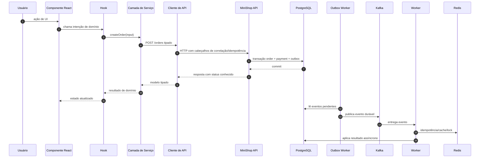

# Fluxo de Requisições do Frontend

Este documento mostra como uma acao React atravessa a arquitetura ate chegar ao
backend distribuido MiniShop.

## Fluxo de comunicacao da API



## Ciclo de vida de requisicoes assincronas

1. A UI captura a intencao do usuario.
2. O hook atualiza estado temporario para `submitting`.
3. O servico monta a chamada de dominio sem conhecer a interface.
4. O cliente de API aplica URL base, cabeçalhos, timeout e politica de retry.
5. A API valida o contrato e persiste no PostgreSQL.
6. O backend grava eventos via outbox para publicacao posterior no Kafka.
7. A resposta HTTP devolve o estado conhecido naquele momento.
8. A UI renderiza `pending`, `confirmed`, `failed` ou outro estado explicito.
9. Leitura posterior por `GET /orders/:id` reconcilia o snapshot do cliente.

## Responsabilidades por camada

| Camada | Pode fazer | Nao deve fazer |
| --- | --- | --- |
| Componentes | Renderizar e coletar intenção | Chamar `fetch` diretamente |
| Hooks | Orquestrar tela, estado e serviços | Conhecer Redis, Kafka ou SQL |
| Serviços | Encapsular contratos da API | Manipular DOM ou UI |
| Cliente de API | HTTP, cabeçalhos, timeout, retry, erros | Regras visuais |
| Stores | Estado temporario do cliente | Ser fonte de verdade |
| Adaptadores de armazenamento | Persistencia local | Acessar backend diretamente |

## Cabeçalhos e rastreamento

`src/services/apiClient.ts` centraliza:

- `Authorization`;
- `X-Correlation-Id`;
- `X-Request-Id`;
- `X-Idempotency-Key`;
- `traceparent`;
- timeout com `AbortController`;
- retries para metodos seguros ou escritas idempotentes;
- interceptadores de requisição e resposta.

Isso permite observar uma acao do navegador ate a API e, depois, ate workers e
eventos. O frontend nao precisa conhecer a implementacao interna do tracing no
backend.

## Como rodar backend e frontend localmente

O MiniShop backend fica no repositorio irmao
`event-driven-order-processing-system-main/event-driven-order-processing-system-main`.
Este playbook frontend fica em `fullstack-system-design-playbook`.

Terminal 1, infraestrutura do backend:

```bash
cd event-driven-order-processing-system-main/event-driven-order-processing-system-main
pnpm install
pnpm infra:up
```

Terminal 2, API:

```bash
cd event-driven-order-processing-system-main/event-driven-order-processing-system-main
pnpm -C apps/api start:dev
```

Terminal 3, outbox worker:

```bash
cd event-driven-order-processing-system-main/event-driven-order-processing-system-main
pnpm -C apps/outbox-worker start:dev
```

Terminal 4, worker Kafka:

```bash
cd event-driven-order-processing-system-main/event-driven-order-processing-system-main
pnpm -C apps/worker start:dev
```

Terminal 5, frontend:

```bash
cd event-driven-order-processing-system-main/fullstack-system-design-playbook
pnpm install
pnpm dev
```

Opcionalmente, crie `.env.local` no frontend:

```bash
VITE_MINISHOP_API_URL=http://localhost:3000
```

URLs locais esperadas:

| Servico | URL |
| --- | --- |
| Frontend | `http://localhost:5173` |
| API | `http://localhost:3000` |
| Saúde da API | `http://localhost:3000/healthz` |
| Kafka UI | `http://localhost:8085` |
| Prometheus | `http://localhost:9090` |
| Grafana | `http://localhost:3001` |
| Jaeger | `http://localhost:16686` |

## Contrato acima da implementacao

A API e o contrato entre a experiencia do usuario e os sistemas distribuidos.
Enquanto Kafka, Redis, workers e PostgreSQL evoluem atras da API, o frontend
continua dependente de modelos TypeScript, servicos e estados de dominio claros.
