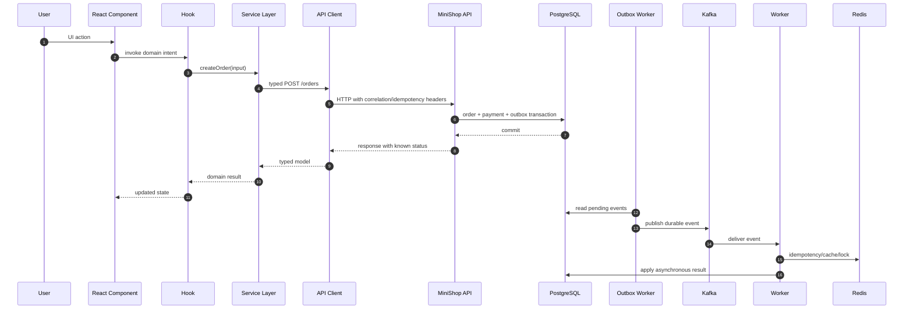

# Frontend Request Flow

This document shows how a React action moves through the architecture to reach
the MiniShop distributed backend.

## API Communication Flow



## Asynchronous Request Lifecycle

1. The UI captures user intent.
2. The hook updates temporary state to `submitting`.
3. The service builds the domain call without knowing the interface.
4. The API client applies the base URL, headers, timeout, and retry policy.
5. The API validates the contract and persists data in PostgreSQL.
6. The backend writes events through the outbox for later publication to Kafka.
7. The HTTP response returns the state known at that moment.
8. The UI renders `pending`, `confirmed`, `failed`, or another explicit state.
9. A subsequent read through `GET /orders/:id` reconciles the client snapshot.

## Responsibilities by Layer

| Layer | Can do | Must not do |
| --- | --- | --- |
| Components | Render and collect intent | Call `fetch` directly |
| Hooks | Orchestrate the screen, state, and services | Know Redis, Kafka, or SQL |
| Services | Encapsulate API contracts | Manipulate the DOM or UI |
| API client | HTTP, headers, timeout, retries, errors | Visual rules |
| Stores | Temporary client state | Be the source of truth |
| Storage adapters | Local persistence | Access the backend directly |

## Headers and Tracing

`src/services/apiClient.ts` centralizes:

- `Authorization`;
- `X-Correlation-Id`;
- `X-Request-Id`;
- `X-Idempotency-Key`;
- `traceparent`;
- timeout with `AbortController`;
- retries for safe methods or idempotent writes;
- request and response interceptors.

This makes it possible to trace an action from the browser to the API and then to
workers and events. The frontend does not need to know the internal backend
tracing implementation.

## Running the Backend and Frontend Locally

The MiniShop backend is in the sibling repository
`event-driven-order-processing-system-main/event-driven-order-processing-system-main`.
This frontend playbook is in `fullstack-system-design-playbook`.

Terminal 1, backend infrastructure:

```bash
cd event-driven-order-processing-system-main/event-driven-order-processing-system-main
pnpm install
pnpm infra:up
```

Terminal 2, API:

```bash
cd event-driven-order-processing-system-main/event-driven-order-processing-system-main
pnpm -C apps/api start:dev
```

Terminal 3, outbox worker:

```bash
cd event-driven-order-processing-system-main/event-driven-order-processing-system-main
pnpm -C apps/outbox-worker start:dev
```

Terminal 4, Kafka worker:

```bash
cd event-driven-order-processing-system-main/event-driven-order-processing-system-main
pnpm -C apps/worker start:dev
```

Terminal 5, frontend:

```bash
cd event-driven-order-processing-system-main/fullstack-system-design-playbook
pnpm install
pnpm dev
```

Optionally, create `.env.local` in the frontend:

```bash
VITE_MINISHOP_API_URL=http://localhost:3000
```

Expected local URLs:

| Service | URL |
| --- | --- |
| Frontend | `http://localhost:5173` |
| API | `http://localhost:3000` |
| API health | `http://localhost:3000/healthz` |
| Kafka UI | `http://localhost:8085` |
| Prometheus | `http://localhost:9090` |
| Grafana | `http://localhost:3001` |
| Jaeger | `http://localhost:16686` |

## Contract over Implementation

The API is the contract between the user experience and distributed systems.
While Kafka, Redis, workers, and PostgreSQL evolve behind the API, the frontend
continues to depend on clear TypeScript models, services, and domain states.
