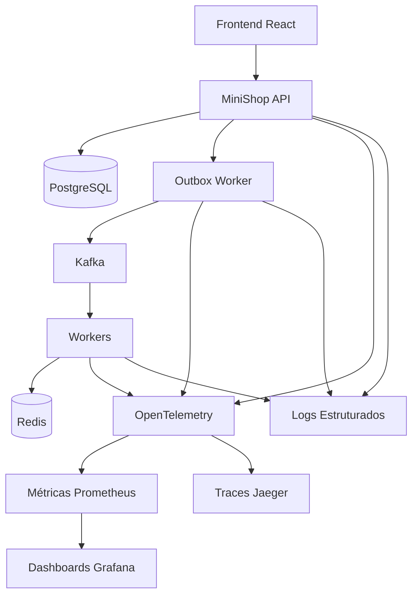

# Observabilidade

Observabilidade dá aos engenheiros uma forma de responder o que aconteceu entre
requisições do frontend, transações da API, publicação de outbox, entrega no
Kafka, execução de workers e atualizações no banco.

## Sinais

## Métricas

Métricas devem responder perguntas sobre taxa, latência, erro e saturação.

Métricas úteis:

- contagem de requisições HTTP por rota, status e trilha de release;
- duração de requisições HTTP em p50, p95 e p99;
- eventos pendentes na outbox;
- falhas de publicação da outbox;
- lag da outbox;
- lag de consumidores Kafka;
- contagem de processamento de workers;
- contagem de retries dos workers;
- contagem de DLQ;
- contagem de verificação de pagamento por resultado;
- contagem de reconciliação de pagamento;
- hits e misses de idempotência no Redis.

## Traces

Traces devem conectar o caminho da requisição do usuário ao processamento
assíncrono.

Atributos de trace:

- `correlation.id`;
- `order.id`;
- `payment.id`;
- `event.id`;
- `messaging.topic`;
- `messaging.partition`;
- `messaging.consumer_group`;
- `service.version`;
- `deployment.version`;
- `release.track`.

O objetivo é inspecionar um checkout específico e enxergar a transação na API, o
span de publicação da outbox, a publicação no Kafka, o consumo pelo worker, a
verificação de pagamento e a atualização no banco.

## Logs

Logs fornecem fatos estruturados. Eles devem ser pesquisáveis e correlacionados.

Campos recomendados:

- timestamp;
- nível;
- nome do serviço;
- ambiente;
- correlation ID;
- order ID;
- payment ID;
- event ID;
- tentativa de retry;
- código de erro;
- mensagem.

Logs não devem ser a única ferramenta de observabilidade. Eles são mais fortes
quando combinados com métricas e traces.

## Prometheus

Prometheus armazena métricas de séries temporais e oferece suporte a regras de
alerta.

Exemplos de condições de alerta:

- aumento sustentado de HTTP 5xx;
- lag da outbox acima do limite;
- contagem de DLQ acima de zero;
- aumento de falhas de verificação de pagamento;
- latência p95 do canário maior que a versão estável;
- pico na taxa de retries dos workers.

## Grafana

Dashboards do Grafana devem ser organizados por pergunta operacional:

- saúde da API;
- taxas de sucesso e pendência no checkout;
- lag da outbox;
- lag de consumidores Kafka;
- throughput dos workers;
- verificação de pagamento;
- DLQ e reprocessamento;
- comparação entre estável e canário.

## Jaeger

Jaeger visualiza traces distribuídos e ajuda a inspecionar o ciclo de vida de
uma única requisição.

Ele é especialmente útil quando o frontend já tem um status, mas o backend ainda
está processando eventos downstream.

## OpenTelemetry

OpenTelemetry padroniza instrumentação entre serviços. Ele torna métricas,
traces e logs mais consistentes entre API, workers e infraestrutura.

A instrumentação deve ser adicionada nos limites:

- entrada HTTP;
- queries de banco;
- polling da outbox;
- publicação no Kafka;
- consumo do Kafka;
- operações Redis;
- chamadas ao gateway de pagamento;
- publicação na DLQ;
- jobs de reconciliação.
