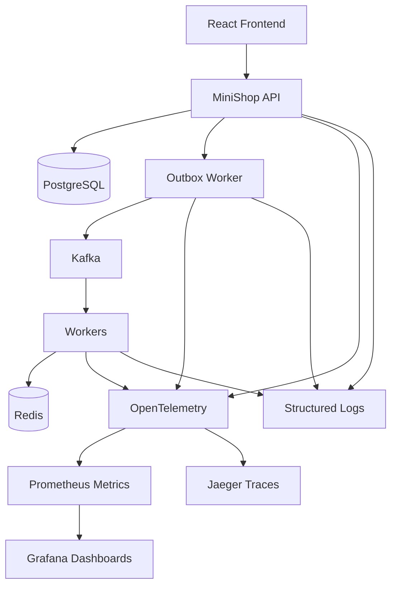

# Observability

Observability gives engineers a way to understand what happened across
frontend requests, API transactions, outbox publication, Kafka delivery,
worker execution, and database updates.

## Signals

## Metrics

Metrics should answer questions about rate, latency, errors, and saturation.

Useful metrics:

- HTTP request count by route, status, and release track;
- HTTP request duration at p50, p95, and p99;
- pending outbox events;
- outbox publication failures;
- outbox lag;
- Kafka consumer lag;
- worker processing count;
- worker retry count;
- DLQ count;
- payment verification count by outcome;
- payment reconciliation count;
- Redis idempotency hits and misses.

## Traces

Traces should connect the user request path to asynchronous
processing.

Trace attributes:

- `correlation.id`;
- `order.id`;
- `payment.id`;
- `event.id`;
- `messaging.topic`;
- `messaging.partition`;
- `messaging.consumer_group`;
- `service.version`;
- `deployment.version`;
- `release.track`.

The goal is to inspect a specific checkout and see the API transaction,
the outbox publication span, Kafka publication, worker consumption,
payment verification, and the database update.

## Logs

Logs provide structured facts. They should be searchable and correlated.

Recommended fields:

- timestamp;
- level;
- service name;
- environment;
- correlation ID;
- order ID;
- payment ID;
- event ID;
- retry attempt;
- error code;
- message.

Logs should not be the only observability tool. They are more effective
when combined with metrics and traces.

## Prometheus

Prometheus stores time-series metrics and supports alerting
rules.

Example alert conditions:

- sustained increase in HTTP 5xx responses;
- outbox lag above the threshold;
- DLQ count above zero;
- increase in payment verification failures;
- canary p95 latency higher than the stable version;
- spike in worker retry rate.

## Grafana

Grafana dashboards should be organized around operational questions:

- API health;
- checkout success and pending rates;
- outbox lag;
- Kafka consumer lag;
- worker throughput;
- payment verification;
- DLQ and reprocessing;
- stable versus canary comparison.

## Jaeger

Jaeger visualizes distributed traces and helps inspect the lifecycle of
a single request.

It is especially useful when the frontend already has a status but the backend
is still processing downstream events.

## OpenTelemetry

OpenTelemetry standardizes instrumentation across services. It makes metrics,
traces, and logs more consistent across the API, workers, and infrastructure.

Instrumentation should be added at boundaries:

- HTTP entry point;
- database queries;
- outbox polling;
- Kafka publication;
- Kafka consumption;
- Redis operations;
- payment gateway calls;
- DLQ publication;
- reconciliation jobs.
