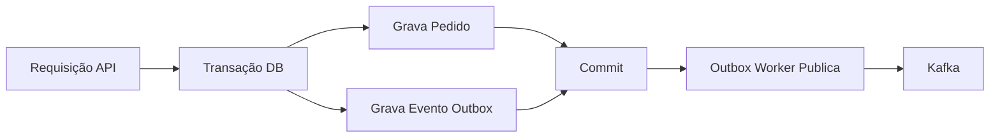
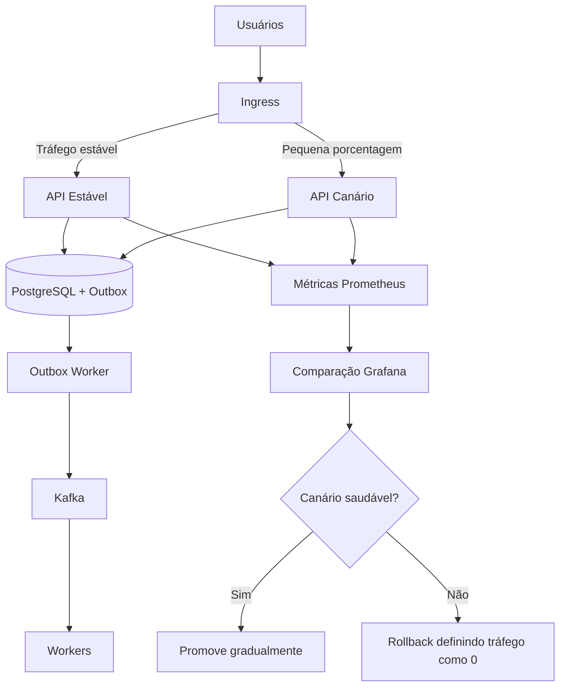

# Padrões de Confiabilidade

Confiabilidade neste playbook significa preservar correção diante de retries,
falhas parciais, entrega duplicada, processamento atrasado e rollout gradual.

## Padrão Outbox

O padrão outbox grava estado de domínio e intenção de evento na mesma transação
de banco.

Isso evita a falha comum em que o commit do banco acontece, mas a publicação do
evento falha.

## Idempotência

Idempotência torna execuções repetidas seguras.

Use em:

- submissão de checkout;
- tentativas de pagamento;
- processamento de webhooks;
- consumidores Kafka;
- reprocessamento de DLQ.

Chaves comuns:

- chave de idempotência da requisição;
- order ID;
- payment ID;
- referência de transação do gateway;
- event ID.

## Retry com Backoff

Retries devem respeitar a saúde das dependências. Loops de retry imediato podem
transformar uma pequena indisponibilidade em uma maior.

Política recomendada de retry:

- classificar erros como retentáveis ou terminais;
- usar backoff exponencial com jitter;
- definir número máximo de tentativas;
- emitir métricas de retry;
- preservar correlation ID entre tentativas.

## DLQ

DLQ é usada quando os retries se esgotam ou quando o processamento é inseguro.

A DLQ não é uma lixeira. Ela é uma fila operacional que exige inspeção, alertas e
replay controlado.

## Consistência Eventual

Consistência eventual significa que o modelo de escrita e o estado de leitura ou
processamento downstream podem diferir temporariamente.

O frontend deve mostrar estados honestos:

- pendente;
- processando;
- confirmado;
- falhou;
- verificação necessária;
- reconciliação necessária.

## Release Canário

Release canário envia uma pequena porcentagem de tráfego para uma nova versão
antes de liberar amplamente.

Canário é mais seguro na borda da API quando contratos de evento continuam
retrocompatíveis e workers permanecem estáveis.

## Entrega Progressiva

Entrega progressiva combina:

- release canário;
- feature flags;
- métricas observáveis de rollout;
- limites explícitos de rollback;
- contratos de evento retrocompatíveis;
- pequenos passos de deploy.

Comportamento de pagamento normalmente deve ser protegido por feature flags ou
allowlists antes de rollout percentual.

## Matriz de Falhas

| Falha | Padrão |
| --- | --- |
| Usuário clica duas vezes no checkout | Chave de idempotência |
| API faz commit, mas Kafka está fora | Outbox transacional |
| Worker recebe evento duplicado | Idempotência no consumidor |
| Gateway de pagamento dá timeout | Estado pendente de verificação |
| Dependência temporariamente indisponível | Retry com backoff |
| Mensagem venenosa | DLQ |
| Nova versão da API regride | Rollback do canário |
| Contrato de evento muda | Evolução retrocompatível de schema |
