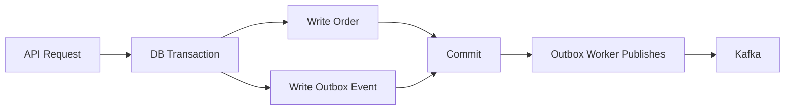
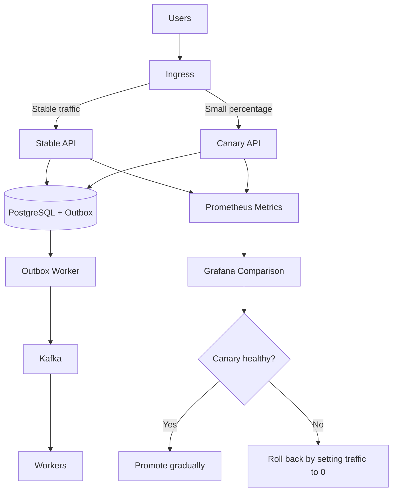

# Reliability Patterns

Reliability in this playbook means preserving correctness in the face of retries,
partial failures, duplicate delivery, delayed processing, and gradual rollout.

## Outbox Pattern

The outbox pattern writes domain state and event intent in the same database
transaction.

This prevents the common failure where the database commit succeeds but event
publication fails.

## Idempotency

Idempotency makes repeated execution safe.

Use it for:

- checkout submission;
- payment attempts;
- webhook processing;
- Kafka consumers;
- DLQ reprocessing.

Common keys:

- request idempotency key;
- order ID;
- payment ID;
- gateway transaction reference;
- event ID.

## Retry with Backoff

Retries should respect dependency health. Immediate retry loops can
turn a small outage into a larger one.

Recommended retry policy:

- classify errors as retryable or terminal;
- use exponential backoff with jitter;
- set a maximum number of attempts;
- emit retry metrics;
- preserve the correlation ID across attempts.

## DLQ

A DLQ is used when retries are exhausted or processing is unsafe.

The DLQ is not a dumping ground. It is an operational queue that requires inspection,
alerts, and controlled replay.

## Eventual Consistency

Eventual consistency means that the write model and downstream read or
processing state can differ temporarily.

The frontend should show accurate states:

- pending;
- processing;
- confirmed;
- failed;
- verification required;
- reconciliation needed.

## Canary Release

A canary release sends a small percentage of traffic to a new version
before a broad rollout.

Canary releases are safer at the API edge when event contracts remain
backward compatible and workers remain stable.

## Progressive Delivery

Progressive delivery combines:

- canary releases;
- feature flags;
- observable rollout metrics;
- explicit rollback thresholds;
- backward-compatible event contracts;
- small deployment steps.

Payment behavior should generally be protected by feature flags or
allowlists before a percentage-based rollout.

## Failure Matrix

| Failure | Pattern |
| --- | --- |
| User clicks checkout twice | Idempotency key |
| API commits, but Kafka is down | Transactional outbox |
| Worker receives a duplicate event | Consumer idempotency |
| Payment gateway times out | Pending verification state |
| Dependency temporarily unavailable | Retry with backoff |
| Poison message | DLQ |
| New API version introduces a regression | Canary rollback |
| Event contract changes | Backward-compatible schema evolution |
