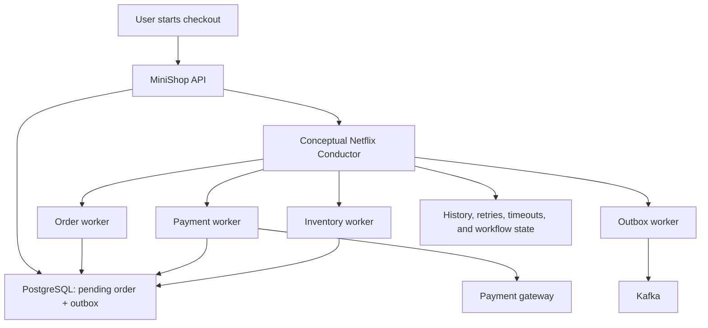
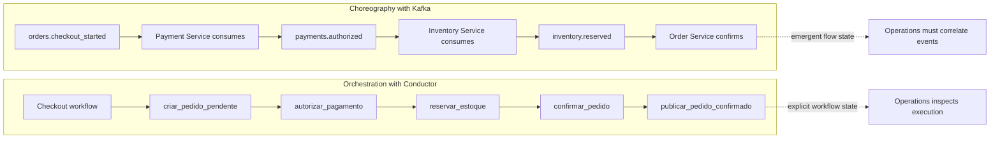

# Saga Orchestration with Netflix Conductor

This directory describes an educational model for designing MiniShop sagas with a workflow engine such as Netflix Conductor. The repository does not run Conductor, provision real infrastructure, or access real endpoints. Everything here is conceptual and mock-based.

## What Is a Saga

A saga coordinates a distributed business transaction when no single ACID transaction covers all services. Instead of trying to include the API, database, payment gateway, Kafka, and workers in one commit, each step makes a local change and publishes signals to continue the flow.

When a later step fails, the saga executes compensating actions. In checkout, for example, if payment was authorized but the order could not be confirmed, compensation can refund the payment, cancel the order, and publish a cancellation event.

## Why Use a Workflow Engine

Teams generally avoid building orchestration from scratch as workflows grow because the difficult part is not calling services in sequence. It is keeping attempts, timeouts, pauses, reprocessing, compensation, auditing, execution history, and the resumption of partially completed workflows visible and manageable.

A workflow engine such as Netflix Conductor provides a specialized layer to:

- model business steps as tasks;
- control retries and timeouts per task;
- record execution history;
- pause and resume workflows;
- expose operational state to operators;
- coordinate compensation in failure scenarios.

## Netflix Conductor in This Playbook

Netflix Conductor is used here as an example of a workflow orchestration engine that can coordinate distributed tasks across microservices. In MiniShop, it could coordinate the checkout saga by calling order, payment, inventory, outbox, and reconciliation workers.

This playbook does not add a Conductor server, Docker Compose, a Conductor database, real workers, or HTTP integration with infrastructure. The intent is to show an architecture that could support a future production implementation.

## Choreography, Orchestration, and Workflow Engines

| Model | How it works | Good for | Consideration |
| --- | --- | --- | --- |
| Choreography-based saga | Each service reacts to events and publishes new events, with no central coordinator. | Simple flows, low coupling, and clear domain events. | The complete flow can become difficult to understand and operate. |
| Orchestration-based saga | A coordinator decides the next step and calls services or workers. | Flows with many steps, compensation, and explicit decision rules. | The coordinator becomes an important design and operational concern. |
| Custom orchestrator | The team builds its own coordinator using code, tables, queues, and internal rules. | Small or highly specific cases. | Retries, history, pauses, operational UI, and auditing tend to grow quickly. |
| Workflow engine orchestrator | A product such as Conductor executes workflow definitions and distributes tasks to workers. | Long-running, auditable, manageable flows with complex compensation. | Adds infrastructure, governance, and a learning curve. |

## Diagram: Saga Orchestration with Conductor

## Diagram: Conductor and Kafka Comparison

## Suggested Reading in This Directory

- [MiniShop + Conductor Blueprint](./minishop-conductor-blueprint.md)
- [Conceptual workflow definition example](./workflow-definition-example.json)
- [Worker contracts](./worker-contracts.md)
- [When to use Conductor](./when-to-use-conductor.md)
