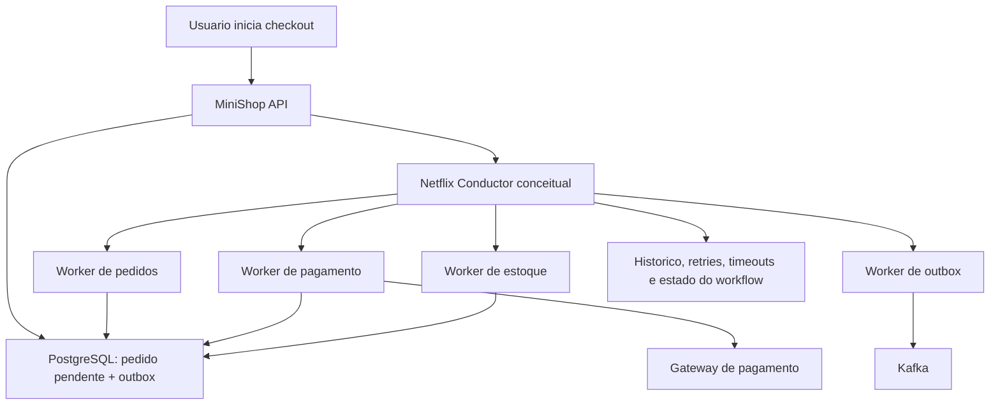
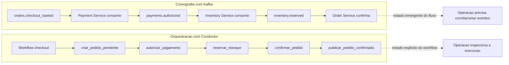

# Orquestracao de Sagas com Netflix Conductor

Este diretorio descreve um modelo didatico para pensar em sagas no MiniShop usando um mecanismo de workflow como o Netflix Conductor. O repositorio nao executa o Conductor, nao provisiona infraestrutura real e nao acessa endpoints reais. Tudo aqui e conceitual e baseado em mocks.

## O que e uma saga

Uma saga e uma forma de coordenar uma transacao de negocio distribuida quando nao existe uma unica transacao ACID cobrindo todos os servicos. Em vez de tentar prender API, banco, gateway de pagamento, Kafka e workers dentro de um mesmo commit, cada etapa faz uma mudanca local e publica sinais para continuar o fluxo.

Quando uma etapa posterior falha, a saga executa acoes de compensacao. No checkout, por exemplo, se o pagamento foi autorizado mas o pedido nao conseguiu ser confirmado, a compensacao pode reembolsar o pagamento, cancelar o pedido e publicar um evento de cancelamento.

## Por que usar um mecanismo de workflow

Equipes geralmente evitam criar orquestracao do zero quando o fluxo cresce porque a parte dificil nao e chamar servicos em ordem. A parte dificil e manter visiveis e operaveis as tentativas, tempos limite, pausas, reprocessamentos, compensacoes, auditoria, historico de execucao e retomada de workflows parcialmente concluidos.

Um mecanismo de workflow como o Netflix Conductor fornece uma camada especializada para:

- modelar passos de negocio como tarefas;
- controlar retries e timeouts por tarefa;
- registrar historico de execucao;
- pausar e retomar workflows;
- expor estado operacional para operadores;
- coordenar compensacoes em cenarios de falha.

## Netflix Conductor neste playbook

O Netflix Conductor e usado aqui como exemplo de mecanismo de orquestracao de workflow capaz de coordenar tarefas distribuidas em microsservicos. No MiniShop, ele poderia coordenar a saga de checkout chamando workers de pedido, pagamento, estoque, outbox e conciliacao.

Este playbook nao adiciona servidor Conductor, Docker Compose, banco do Conductor, workers reais ou integracao HTTP com a infraestrutura. A intencao e mostrar a arquitetura que poderia existir em uma evolucao de producao.

## Coreografia, orquestracao e motores de workflow

| Modelo | Como funciona | Bom para | Cuidado |
| --- | --- | --- | --- |
| Saga baseada em coreografia | Cada servico reage a eventos, publica novos eventos e nao existe um coordenador central. | Fluxos simples, baixo acoplamento e eventos de dominio claros. | O fluxo completo pode ficar dificil de enxergar e operar. |
| Saga baseada em orquestracao | Um coordenador decide a proxima etapa e chama servicos ou workers. | Fluxos com muitas etapas, compensacao e regras de decisao explicitas. | O coordenador vira um ponto importante de desenho e operacao. |
| Orquestrador personalizado | A equipe cria seu proprio coordenador com codigo, tabelas, filas e regras internas. | Casos pequenos ou muito especificos. | Retries, historico, pausas, UI operacional e auditoria costumam crescer rapido. |
| Orquestrador de mecanismo de workflow | Um produto como Conductor executa definicoes de workflow e distribui tarefas para workers. | Fluxos longos, auditaveis, operaveis e com compensacoes complexas. | Adiciona infraestrutura, governanca e curva de aprendizado. |

## Diagrama: orquestracao de saga com Conductor

## Diagrama: comparacao entre Conductor e Kafka

## Leitura sugerida neste diretorio

- [Blueprint MiniShop + Conductor](./minishop-conductor-blueprint.md)
- [Exemplo conceitual de definicao de workflow](./workflow-definition-example.json)
- [Contratos de workers](./worker-contracts.md)
- [Quando usar Conductor](./when-to-use-conductor.md)
