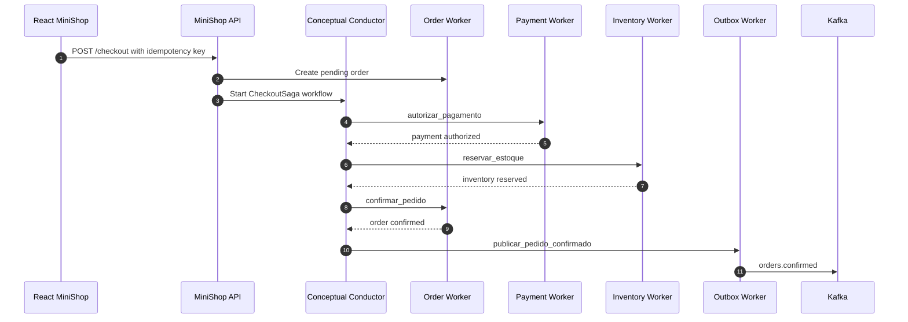
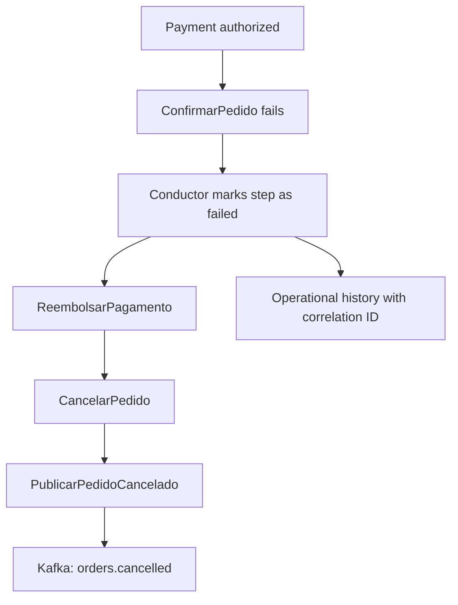
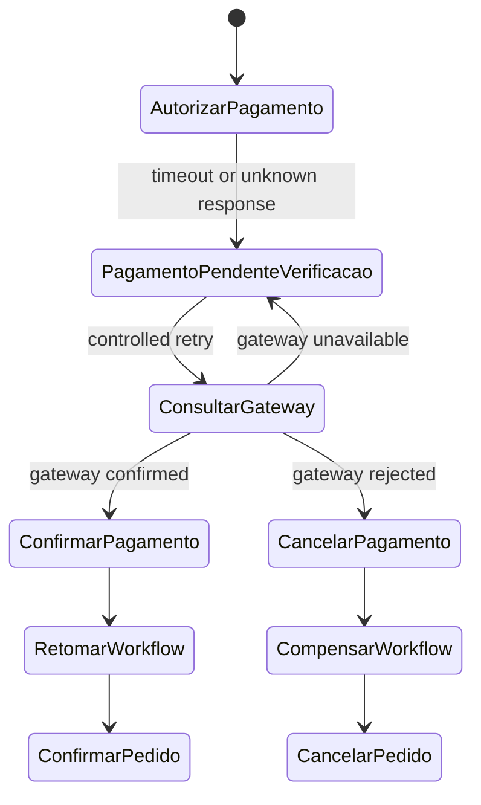

# MiniShop + Netflix Conductor Blueprint

This blueprint shows how MiniShop could evolve to use Netflix Conductor as a saga orchestrator without replacing the current backend. The API, PostgreSQL, outbox, Kafka, Redis, and workers remain core concepts. Conductor would provide an advanced layer for coordinating longer business workflows.

## Principles

- The existing MiniShop backend is not replaced.
- Conductor does not directly access React component internals.
- Workers remain responsible for integrations with services, databases, and gateways.
- The workflow engine coordinates sequencing, decisions, retries, timeouts, pauses, and compensation.
- Kafka remains useful for domain events, asynchronous integration, and communication between contexts.
- This repository's example is conceptual, lightweight, and mock-based.

## Conceptual Checkout Flow

```text
CheckoutIniciado
↓
CriarPedidoPendente
↓
AutorizarPagamento
↓
ReservarEstoque
↓
ConfirmarPedido
↓
PublicarPedidoConfirmado
```

## Diagram: Happy-Path Checkout Flow



## Compensation Flow

If `AutorizarPagamento` succeeds but `ConfirmarPedido` fails:

```text
ReembolsarPagamento
↓
CancelarPedido
↓
PublicarPedidoCancelado
```

## Diagram: Compensation Workflow



## Unknown Payment Outcome

If the payment outcome is unknown, the workflow should pause confirmation and check the gateway before deciding:

```text
PagamentoPendenteVerificacao
↓
Query the Payment Gateway
↓
ConfirmarPagamento or CancelarPagamento
↓
Resume workflow
```

## Diagram: Payment Timeout and Suspended Workflow



## Suggested Responsibilities

| Owner | Role in the model |
| --- | --- |
| React MiniShop | Displays state received from the API and the simulated console. Has no knowledge of a real Conductor instance. |
| MiniShop API | Receives checkout requests, creates initial records, and starts or references the workflow. |
| Conductor | Maintains workflow state, decides the next tasks, and applies retries and timeouts. |
| Workers | Execute specific tasks, use idempotency, and report success or failure. |
| PostgreSQL | Remains the source of truth for orders, payments, and the outbox. |
| Kafka | Distributes committed domain events to other consumers. |
| Redis | Supports idempotency, short-lived locks, and worker deduplication. |
| Observability | Correlates the API, workflow, workers, Kafka, and database. |

## Where This Fits in MiniShop

Conductor would be a layer above the domain services, not a replacement for them. The workflow would call workers that continue to use explicit contracts, idempotency keys, correlation IDs, and local transactional operations.

In a real implementation, the API could return a `workflowId` alongside the `orderId`. The UI would not need to call Conductor directly. It would query the MiniShop API, which would translate operational state into a safe product model.
