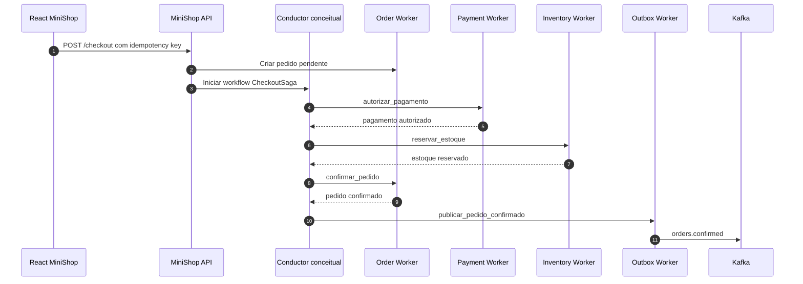
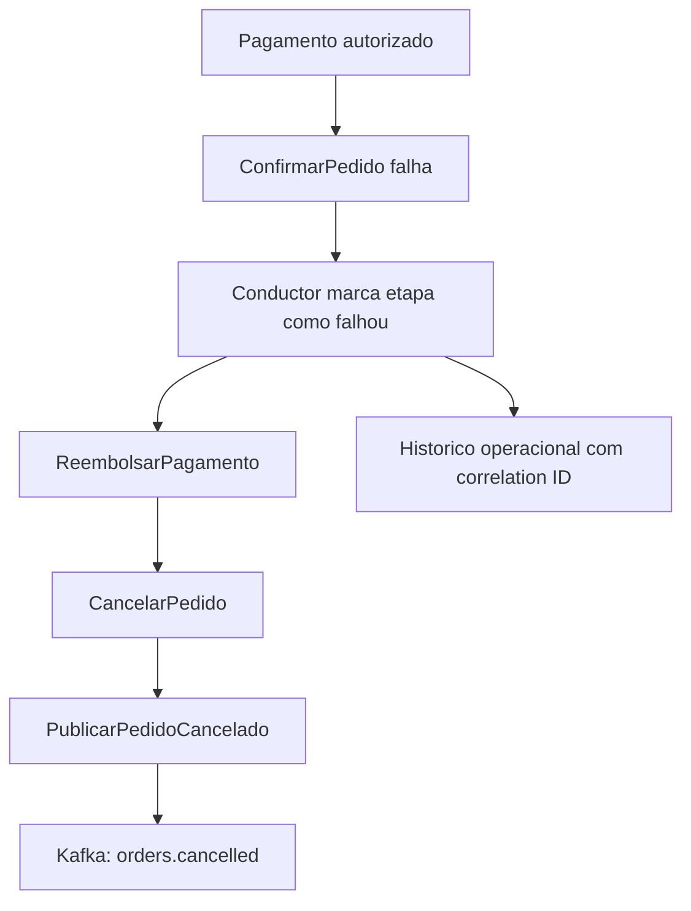
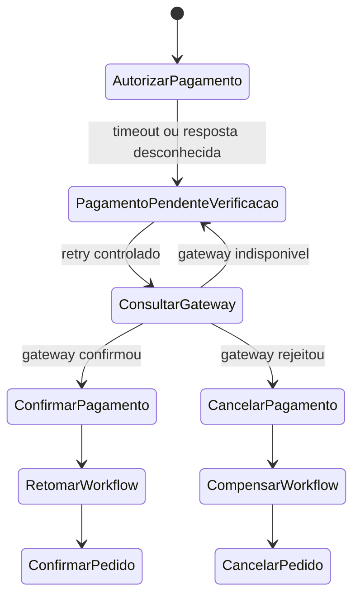

# Blueprint MiniShop + Netflix Conductor

Este blueprint mostra como o MiniShop poderia evoluir para usar o Netflix Conductor como orquestrador de sagas sem substituir o backend atual. A API, o PostgreSQL, o outbox, Kafka, Redis e workers continuam sendo conceitos centrais. O Conductor entraria como uma camada avancada para coordenar workflows de negocio mais longos.

## Principios

- O backend existente do MiniShop nao e substituido.
- O Conductor nao acessa diretamente detalhes internos dos componentes React.
- Workers continuam donos das integracoes com servicos, bancos e gateways.
- O workflow engine coordena ordem, decisao, retry, timeout, pausa e compensacao.
- O Kafka continua util para eventos de dominio, integracao assincrona e comunicacao entre contextos.
- O exemplo deste repositorio e conceitual, leve e baseado em mocks.

## Fluxo conceitual de checkout

```text
CheckoutIniciado
↓
CriarPedidoPendente
↓
AutorizarPagamento
↓
ReservarEstoque
↓
ConfirmarPedido
↓
PublicarPedidoConfirmado
```

## Diagrama: fluxo de checkout com caminho feliz



## Fluxo de compensacao

Se `AutorizarPagamento` for bem-sucedido, mas `ConfirmarPedido` falhar:

```text
ReembolsarPagamento
↓
CancelarPedido
↓
PublicarPedidoCancelado
```

## Diagrama: fluxo de trabalho de compensacao



## Resultado de pagamento desconhecido

Se o resultado do pagamento for desconhecido, o workflow deve pausar a confirmacao e verificar o gateway antes de decidir:

```text
PagamentoPendenteVerificacao
↓
Consultar o Gateway de Pagamento
↓
ConfirmarPagamento ou CancelarPagamento
↓
Retomar fluxo de trabalho
```

## Diagrama: tempo limite de pagamento e workflow em suspenso



## Responsabilidades sugeridas

| Responsavel | Papel no modelo |
| --- | --- |
| React MiniShop | Exibe o estado recebido pela API e pelo console simulado. Nao conhece Conductor real. |
| MiniShop API | Recebe checkout, cria registros iniciais e inicia ou referencia o workflow. |
| Conductor | Mantem estado do workflow, decide proximas tarefas, aplica retries e timeouts. |
| Workers | Executam tarefas especificas, usam idempotencia e reportam sucesso ou falha. |
| PostgreSQL | Continua como fonte de verdade para pedidos, pagamentos e outbox. |
| Kafka | Distribui eventos de dominio confirmados para outros consumidores. |
| Redis | Ajuda em idempotencia, locks curtos e deduplicacao de workers. |
| Observabilidade | Correlaciona API, workflow, workers, Kafka e banco. |

## Onde isso se encaixa no MiniShop

O Conductor seria uma camada acima dos servicos de dominio, nao uma substituicao deles. O workflow chamaria workers que continuam usando contratos explicitos, idempotency keys, correlation IDs e operacoes locais transacionais.

Em uma implementacao real, a API poderia retornar um `workflowId` junto com o `orderId`. A UI nao precisaria chamar o Conductor diretamente. Ela consultaria a API do MiniShop, que traduziria o estado operacional para um modelo de produto seguro.
